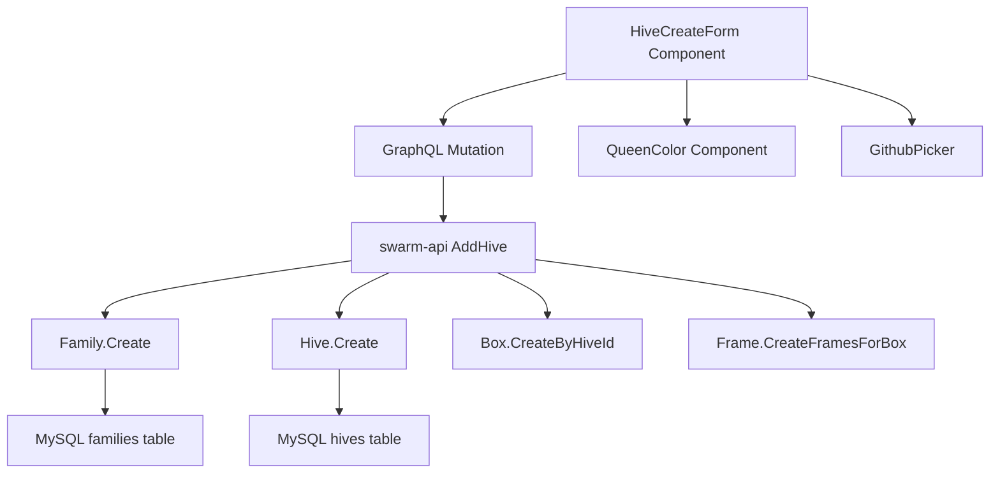

# Why
The hive creation form had several UX issues:
- Layout was not mobile-friendly - the hive icon consumed significant horizontal space
- Missing queen management features that were available in hive edit view (year and color selection)
- Missing hive number input field
- Default section count was 2, which is excessive for initial hive setup

# Changes
## Web-app (frontend)
- **Responsive layout with CSS modules**: Created `styles.module.less` for mobile-first responsive design
  - **Mobile (< 768px)**: 
    - Hive icon centered above form inputs
    - Labels positioned above inputs with no left padding for perfect alignment
    - Queen name with refresh button on the right
    - Queen year with color picker dot on same line (no border/background on color)
  - **Desktop (≥ 768px)**:
    - Labels on the left (140px width, right-aligned)
    - Inputs on the right (traditional horizontal form layout)
  - **Used `!important` flags** to override VisualForm's table-based layout
- **Queen year input**: Added input field for queen marking year (defaults to current year)
- **Queen color selection**: Integrated color picker component (GithubPicker) reused from hive edit view
  - Visual color dot display using existing QueenColor component
  - Supports 44 color options matching beekeeping year marking standards
  - Auto-suggests color based on year if no custom color selected
- **Hive number input**: Added optional numeric input for hive numbering
- **Default section count**: Changed from 2 to 1 box (more practical default)
- **Updated mutation**: Extended GraphQL mutation to include queenYear, queenColor, and hiveNumber parameters

## Swarm-api (backend)
- **Schema updates**: 
  - Added `queenYear: String` to HiveInput
  - Added `queenColor: String` to HiveInput
- **Model updates**: Updated HiveInput Go struct with QueenYear and QueenColor fields
- **Resolver logic**: Modified AddHive resolver to use queenYear and queenColor from input instead of hardcoded values
  - Falls back to current year if queenYear not provided
  - Passes queenColor to Family.Create() method

## Code reuse
- Reused `QueenColor` component from hive edit view
- Reused `GithubPicker` color palette from AddQueenModal
- Reused `getQueenColorFromYear` utility function for color suggestions
- Used CSS modules pattern consistent with other components (e.g., apiaryEdit)

## Architectural diagram


# Testing
- Manual testing required for:
  - Mobile responsiveness of new layout
  - Queen color picker interaction
  - Queen year input validation
  - Hive number input
  - Default values (boxCount=1, queenYear=current year)
  - Color persistence after hive creation
  - Integration with existing hive edit flow

## Test scenarios
1. Create hive with default values - should create 1 box with current year queen
2. Create hive with custom queen year - should use provided year
3. Create hive with custom queen color - should override year-based color
4. Create hive on mobile device - layout should be vertical with labels above inputs
5. Create hive with hive number - should save and display in hive list
6. Verify refresh button appears on right side of queen name input
7. Verify queen color picker appears on right side of year input on same line
8. Test on various screen sizes (320px, 375px, 768px, 1024px)

## Backend command for schema regeneration
If you need to regenerate the GraphQL schema in swarm-api:
```bash
cd /Users/artjom/git/swarm-api
just gen
```

