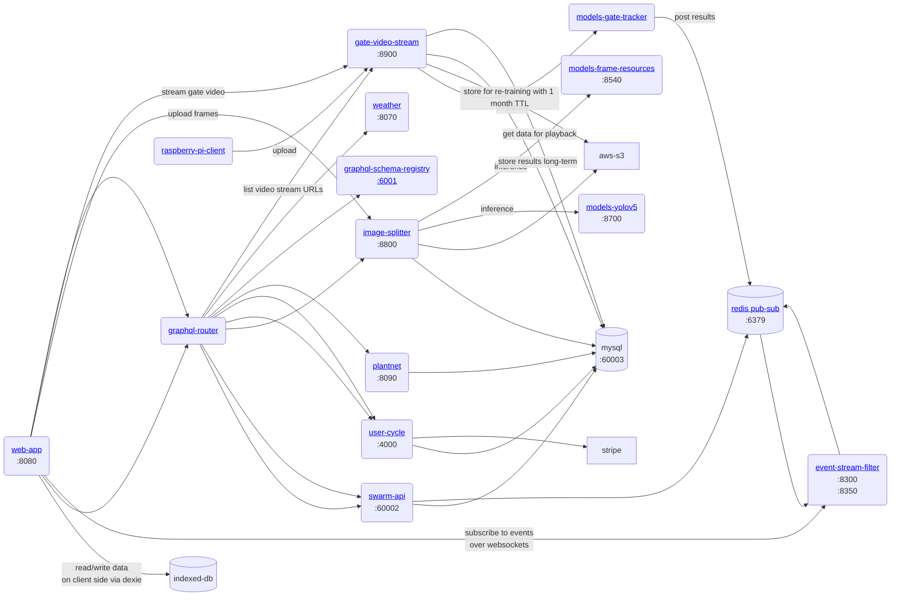

# gratheon / web-app

Single page app for beehive management.

## Features
- manage beehives
- manage of apiaries (groups of beehives)
	- display weather apiary is at
	- display local plants apiary is near to 
- manage beehive boxes (for vertical types)
- manage box frames
- manage frame sides, including image upload
	- frame side image processing to detect resource distribution
	- resource distribution visualization


## Architecture



## URLs

| env   | url                       |
| ----- | ------------------------- |
| local | http://0.0.0.0:8080/      |
| live  | https://app.gratheon.com/ |

### Tech stack
|dependency|why|
|--|--|
|typescript| for reliability via strict types|
|preact (builder)| for performance|
|react| for modularity and compatibility with other UI components|
|react-router|for navigation|
|urql| for performant graphql data loading|
|dexie| for storing data to index-db on the client for offline mode|

## Development
Although Gratheon app is opensource, you do need to change configuration across all microservices.

```
tilt up
```
