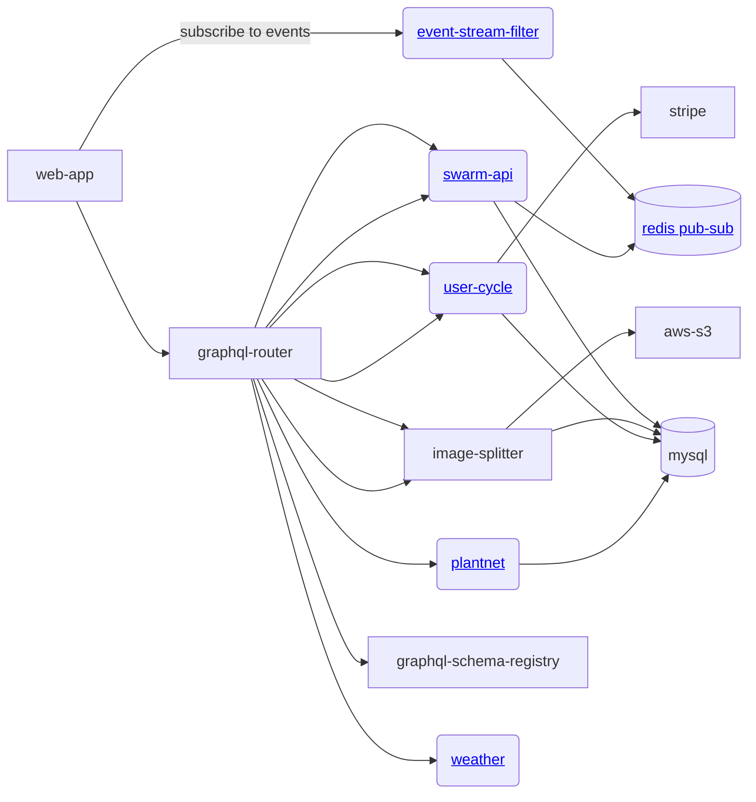

# gratheon / web-app
Single page app for beehive management


## Architecture



## URLs

|env|url|
|--|--|
|local|http://0.0.0.0:8080/|
|live|https://app.gratheon.com/|


### Tech stack
- preact (builder)
- react
- react-router
- apollo client

## Development
```
npm run develop
```
