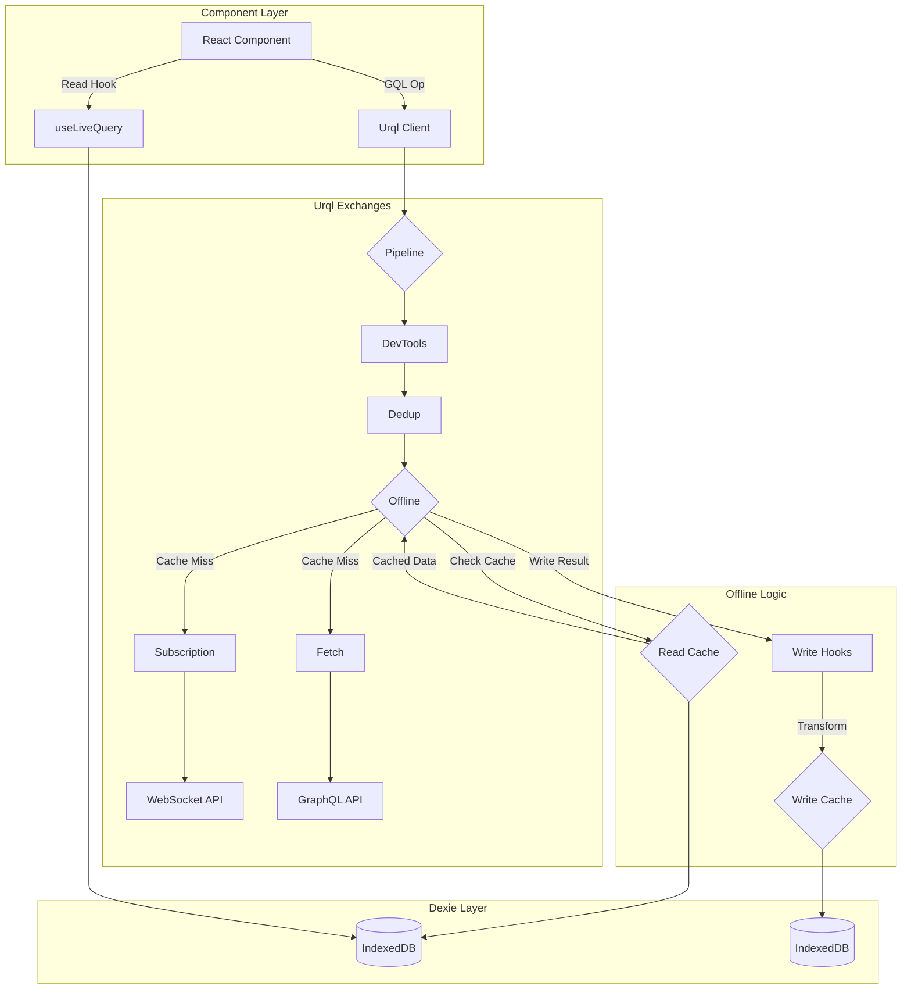
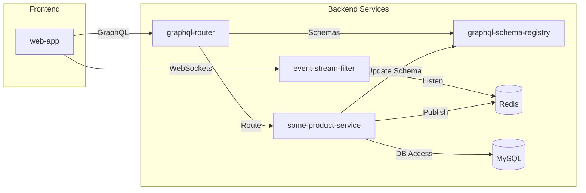

# Gratheon Web Application

[](https://www.gnu.org/licenses/agpl-3.0)

Frontend application for the Gratheon beehive management and analytics platform. Built with Preact, Vite, Urql, and Dexie for offline support.

See [product feature and ideas](https://gratheon.com/about/products/%F0%9F%93%B1Web-app/), also see technical [architecture docs]([https://gratheon.com/docs/web-app/](https://gratheon.com/docs/%F0%9F%93%B1%20Web-app/)) for the entire system


**Live Application:** [https://app.gratheon.com/](https://app.gratheon.com/)


## Table of Contents

- [Overview](#overview)
- [Getting Started](#getting-started)
  - [Prerequisites](#prerequisites)
  - [Installation](#installation)
  - [Running the Application](#running-the-application)
- [Architecture](#architecture)
  - [High-Level Frontend Architecture](#high-level-frontend-architecture)
  - [Component Structure](#component-structure)
  - [State Management & Data Flow (Urql + Dexie)](#state-management--data-flow-urql--dexie)
  - [Backend Interaction](#backend-interaction)
  - [Tech Stack](#tech-stack)
- [Project Structure](#project-structure)
- [Configuration](#configuration)
- [Available Scripts](#available-scripts)
- [Testing](#testing)
  - [Unit Tests](#unit-tests)
  - [End-to-End (E2E) Tests](#end-to-end-e2e-tests)
- [Deployment](#deployment)
- [Contributing](#contributing)
- [License](#license)
- [Support](#support)

## Overview

This repository contains the source code for the Gratheon web application frontend. Gratheon aims to provide comprehensive beehive management and analytics solutions for beekeepers. This web application serves as the primary user interface for interacting with the platform's data and features.

Users can manage their apiaries and hives, log detailed inspections, upload and analyze frame photos (leveraging backend AI services like `image-splitter`), track environmental conditions (via `weather` service integration), manage billing (`user-cycle`), and potentially monitor hive entrances (`entrance-observer`). The application interacts with a suite of backend microservices through a federated GraphQL API.

**Key Features:**

*   Apiary and Hive Management
*   Inspection Logging and Tracking
*   Data Visualization (Charts via Recharts)
*   Mapping of Apiaries/Hives (Leaflet)
*   Offline Data Access and Synchronization (Urql + Dexie)
*   Real-time Updates (GraphQL Subscriptions via WebSockets)
*   Image Upload and Annotation Capabilities

**Core Technologies:**

*   **UI Framework:** Preact / React
*   **Build Tool:** Vite
*   **Language:** TypeScript
*   **GraphQL Client:** Urql
*   **Offline Storage:** Dexie (IndexedDB wrapper)
*   **Styling:** Less Modules
*   **Routing:** React Router

## Getting Started

### Prerequisites

*   **Node.js:** Version 20 (as specified in `.nvmrc`).
*   **nvm (Node Version Manager):** Recommended for managing Node.js versions. [Install nvm](https://github.com/nvm-sh/nvm#installing-and-updating).
*   **just:** A command runner used for simplifying common tasks. [Install just](https://github.com/casey/just#installation).
*   **Docker & Docker Compose:** Required *only* if running the full stack locally (including backend services).

### Installation

1.  Clone the repository:
    ```bash
    git clone https://github.com/Gratheon/web-app.git
    ```
2.  Navigate to the project directory:
    ```bash
    cd web-app
    ```
3.  Use the correct Node.js version:
    ```bash
    nvm use
    ```
4.  Install dependencies:
    ```bash
    npm install
    ```

### Running the Application

#### Development (Frontend Only)

This is the quickest way to work on UI components. It connects to the **production** backend API.

```bash
just start
```

Open [http://localhost:8080/](http://localhost:8080/) in your browser. You can log in using your existing credentials from `app.gratheon.com`.

#### Development (Full Stack Local)

This mode connects the frontend to locally running backend services.

1.  **Configure Frontend:** Modify `web-app/src/uri.ts` and set `USE_PROD_BACKEND_FOR_DEV` to `false`.
2.  **Run Backend Services:** Ensure all required backend microservices (GraphQL Router, Event Stream Filter, etc.) are running locally. Refer to the main project documentation or the root `Makefile`/`docker-compose` files for instructions (e.g., potentially `make dev` in the project root). You might need to adjust configuration in individual backend services.
3.  **Run Frontend:**
    ```bash
    just start
    ```
    The application will now communicate with your local backend services.

#### Production Build

This command compiles and optimizes the application for production.

```bash
npm run build
```

Static assets will be generated in the `dist/` directory (which might be moved to `public/` by subsequent scripts like `build-move`).

#### Previewing Production Build

This command serves the production build locally using Vite's preview server.

```bash
npm run preview
```

## Architecture

### High-Level Frontend Architecture

This application is a Single Page Application (SPA) built with Preact/React and Vite. It utilizes Urql for GraphQL communication and Dexie for robust offline data storage via IndexedDB.

*(Architecture diagrams were removed due to persistent Mermaid parsing issues. They can be revisited later.)*

### Component Structure

*   **Layouts (`src/page/index.tsx`):** Defines the main page structures based on authentication state (`LoggedInPage`, `PageWithMenu`, `LoggedOutPage`).
*   **Pages (`src/page/*`):** Represent distinct views or routes within the application (e.g., `ApiaryList`, `HiveEdit`, `InspectionShare`).
*   **Shared Components (`src/shared/*`):** Reusable UI elements used across multiple pages (e.g., `Button`, `Header`, `Map`, `Loader`, `VisualForm`).

### State Management & Data Flow (Urql + Dexie)

State management primarily revolves around data fetching and caching, handled by Urql and Dexie for offline capabilities.

*   **Urql (`src/api/index.ts`):** The core GraphQL client. It uses a pipeline of exchanges to manage requests, caching, subscriptions, and offline storage.
*   **Dexie (`src/models/db/index.ts`):** A wrapper around IndexedDB, providing a more developer-friendly API for client-side database operations.
*   **`offlineIndexDbExchange` (`src/api/offlineIndexDbExchange.ts`):** This custom Urql exchange is the key to offline support.
    1.  It intercepts GraphQL requests.
    2.  Checks the Dexie (IndexedDB) cache for requested data.
    3.  If valid cached data exists, it's returned immediately.
    4.  If not cached or stale, the request is forwarded to the network via other exchanges (like `multipartFetchExchange`).
    5.  Network responses are written back to the Dexie cache using `writeHooks` (`src/models/db/writeHooks.ts`) for data normalization before storage.
*   **Dynamic Schema Sync:** On application load (`src/app.tsx`), the `syncGraphqlSchemaToIndexDB` function uses the GraphQL schema definition (`src/api/schema.ts`) to dynamically create or update the IndexedDB table structures managed by Dexie. This ensures the client-side database schema stays aligned with the API schema.
*   **Live Queries:** Components often use Dexie's `useLiveQuery` hook (`dexie-react-hooks`) to subscribe directly to IndexedDB data, ensuring the UI updates reactively when the cache changes (either from network responses or background sync).



### Backend Interaction

The web application interacts with several backend microservices, primarily through a GraphQL router. The key interactions involve fetching data via GraphQL, receiving real-time updates via WebSockets, and coordinating schema changes through a registry.



### Tech Stack

| Dependency           | Version | Why                                                              |
| -------------------- | ------- | ---------------------------------------------------------------- |
| **Framework**        |         |                                                                  |
| Preact               | ^10.23  | High-performance UI library with React compatibility             |
| React (Compatibility)| ^18.3   | Used via Preact compatibility layer                              |
| **Build & Dev**      |         |                                                                  |
| Vite                 | ^5.4    | Fast build tool and development server                           |
| TypeScript           | ^5.5    | Static typing for improved code reliability and maintainability  |
| **Routing**          |         |                                                                  |
| React Router         | ^6.6    | Standard library for client-side routing in React applications   |
| **GraphQL Client**   |         |                                                                  |
| Urql                 | ^3.0    | Performant and extensible GraphQL client (chosen over Apollo for smaller bundle size and Relay for less opinionated API) |
| graphql-ws           | ^5.11   | Client for GraphQL subscriptions over WebSockets                 |
| **Offline Storage**  |         |                                                                  |
| Dexie                | ^3.2    | Wrapper for IndexedDB, simplifying client-side database operations |
| dexie-react-hooks    | ^1.1    | React hooks for integrating Dexie live queries                   |
| **Styling**          |         |                                                                  |
| Less                 | ^4.2    | CSS preprocessor, used with CSS Modules                          |
| **Utilities**        |         |                                                                  |
| date-fns             | ^2.30   | Modern JavaScript date utility library                           |
| lodash               | ^4.17   | Utility library for common programming tasks                     |
| **Mapping**          |         |                                                                  |
| Leaflet              | ^1.9    | Interactive map library                                          |
| React Leaflet        | ^4.2    | React components for Leaflet maps                                |
| **Charting**         |         |                                                                  |
| Recharts             | ^2.12   | Composable charting library built with React                     |
| **Error Reporting**  |         |                                                                  |
| Sentry               | ^8.26   | Error tracking and performance monitoring                        |
| **Analytics**        |         |                                                                  |
| Amplitude            | ^2.3    | Product analytics                                                |
| MS Clarity           | -       | User behavior analytics (heatmaps, session recordings)           |
| **Testing**          |         |                                                                  |
| Playwright           | ^1.46   | End-to-end testing framework                                     |
| Jest                 | ^29.3   | JavaScript testing framework (configuration present, usage low)  |

## Project Structure

```
web-app/
├── config/                 # Deployment configurations (e.g., Nginx)
├── public/                 # Static assets served directly (output of build often moved here)
├── src/                    # Main application source code
│   ├── api/                # GraphQL client (Urql), exchanges, offline logic
│   ├── assets/             # Images, icons, fonts
│   ├── config/             # Application runtime configuration
│   ├── hooks/              # Custom React hooks
│   ├── icons/              # SVG icon components
│   ├── models/             # TypeScript types and interfaces, Dexie DB setup
│   │   └── db/             # Dexie database schema, hooks, setup
│   ├── page/               # Top-level page components and routing logic
│   ├── shared/             # Reusable UI components (Button, Map, etc.)
│   ├── styles/             # Global styles (though most are CSS Modules)
│   ├── app.tsx             # Root application component
│   ├── main.tsx            # Application entry point (renders App)
│   ├── index.css           # Global CSS entry point
│   ├── uri.ts              # URI/endpoint management
│   └── user.ts             # User session/authentication helpers
├── test/                   # Test configurations and utilities
│   └── ui/                 # Playwright E2E tests
├── .env                    # Environment variables (if any, not checked in)
├── .gitignore              # Files ignored by Git
├── .nvmrc                  # Specifies Node.js version
├── Dockerfile              # Docker image definition for deployment
├── docker-compose.yml      # Docker Compose for production-like environments
├── docker-compose.dev.yml  # Docker Compose for local development
├── justfile                # Command definitions for 'just' runner
├── package.json            # Project metadata and dependencies
├── tsconfig.json           # TypeScript compiler configuration
└── vite.config.ts          # Vite build tool configuration
```

## Configuration

*   **API Endpoints:** Configured primarily in `src/uri.ts`. The `USE_PROD_BACKEND_FOR_DEV` flag controls whether to target production or local backend services during development.
*   **Environment Variables:** While not explicitly listed, Vite supports standard `.env` file conventions (`.env`, `.env.local`, `.env.development`, `.env.production`) for build-time environment variables. Check `vite.config.ts` for usage.

## Available Scripts

Common tasks are managed via `npm` scripts (defined in `package.json`) and `just` commands (defined in `justfile`).

*   `just start` or `npm run dev`: Starts the Vite development server (hot-reloading enabled).
*   `npm run build`: Creates an optimized production build in the `dist/` folder.
*   `npm run build-clean`: Removes contents of the `public/` directory.
*   `npm run build-move`: Moves contents from `dist/` to `public/` (likely part of a build pipeline).
*   `npm run preview`: Serves the production build locally for previewing.
*   `npm run prettier`: Formats code using Prettier.
*   `just test-ui-headless`: Runs Playwright E2E tests in headless mode.
*   `just test-ui-create`: Interactively generates boilerplate for a new Playwright test.
*   `npm run test` / `npm run test:unit`: Placeholder/intended script for running unit tests (currently limited).

## Testing

### Unit Tests

*   **Framework:** Jest is configured (`test/jest.config.ts`), intended for use with Preact.
*   **Current Status:** The previous README indicated a lack of comprehensive unit tests. Contributions are welcome.

### End-to-End (E2E) Tests

*   **Framework:** Playwright (`test/ui/`) is used for browser automation testing.
*   **Running Tests:**
    *   Headless: `just test-ui-headless`
    *   Interactive (headed): Run Playwright commands directly or use VS Code Playwright extension.
*   **Creating Tests:** `just test-ui-create`
*   **CI Status:** E2E tests are not currently integrated into a CI pipeline.

## Deployment

*   The application is containerized using Docker (`Dockerfile`).
*   The `config/nginx.conf` suggests deployment behind an Nginx reverse proxy, likely serving the static build assets and potentially proxying API requests.
*   Deployment specifics (CI/CD pipeline, hosting environment) are not detailed in this repository.

## Contributing

*   Please refer to the `CODEOWNERS` file for ownership details.
*   Code style is enforced by Prettier (`npm run prettier`).
*   Follow standard GitHub flow: Fork the repository, create a feature branch, make changes, and submit a Pull Request.

## License

This project is licensed under the **GNU Affero General Public License v3.0 (AGPL-3.0)**. See the [LICENSE](LICENSE) file for details.

## Support

For issues, questions, or support, please refer to the main Gratheon project communication channels or open an issue in this repository.
