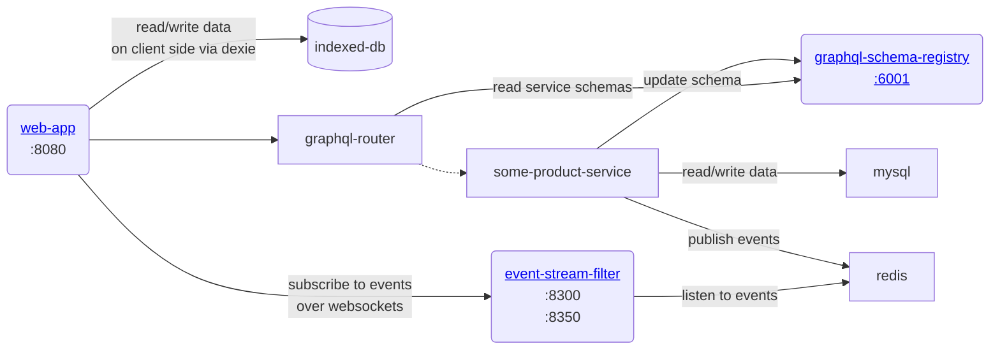
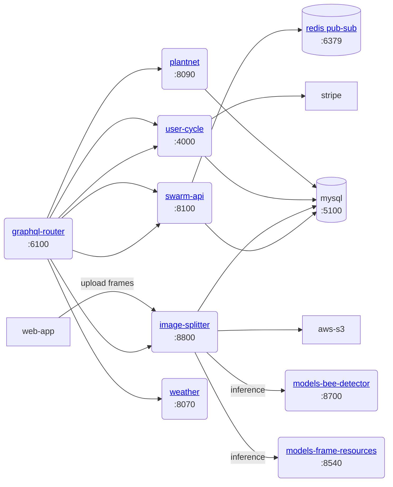
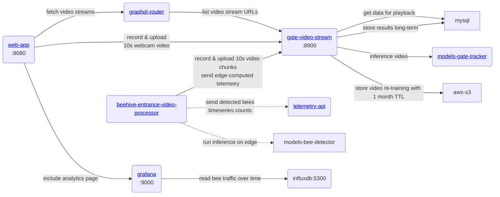
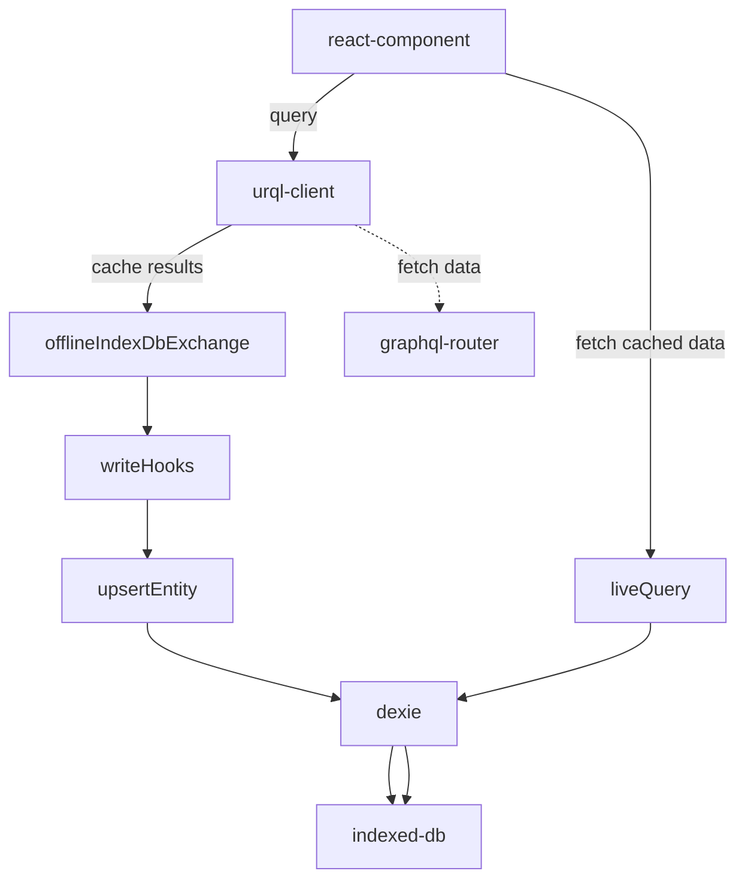

# gratheon / web-app

Web app for beehive management and analytics

## Features

- manage beehives
- manage of apiaries (groups of beehives)
  - display weather apiary is at
  - display local plants apiary is near to
- manage beehive boxes (for vertical types)
- manage box frames
- manage frame sides, including image upload
  - frame side image processing to detect resource distribution
  - resource distribution visualization
- video stream beehive entrance
- analyze collected metrics in grafana and time-series DB

See all features [in Notion](https://gratheon.notion.site/App-platform-2937ed264e1d434a8664caa4bc40978e)

## Development

Running web-app as a frontend in development mode is easy.
To run, you need [nvm](https://github.com/nvm-sh/nvm) and [just](https://github.com/casey/just):

```bash
just start
open http://localhost:8080/
```

By default, web-app will attempt to contact production backend.
So login with your credentials from https://app.gratheon.com/, assuming you have registered.
In this mode you will not be able to change graphql schema as flexibly.

### Developing with local backend

- Change src/components/uri.ts and set `USE_PROD_BACKEND_FOR_DEV` to false

- Spin up the backend. locally, you can use `make dev` in the root of the projects. Follow https://gratheon.notion.site/Onboarding-91481a8152cf4d1685770ec2a7cc7c94 for more details

- You will need to change configuration (in `config` folder) in all of the microservices (see the architecture)

### URLs

| env   | url                       |
| ----- | ------------------------- |
| local | http://localhost:8080/    |
| live  | https://app.gratheon.com/ |


## Architecture

### Core services and routing



### Product services & image processing



### Video processing, playback and analytics



### Tech stack

| dependency       | why                                                         |
| ---------------- | ----------------------------------------------------------- |
| typescript       | for reliability via strict types                            |
| preact (builder) | for performance                                             |
| vite             | CLI builder and hot reload                                  |
| react            | for modularity and compatibility with other UI components   |
| react-router     | for navigation                                              |
| urql             | for performant graphql data loading                         |
| dexie            | for storing data to index-db on the client for offline mode |

### Testing

We don't have any tests atm :(

#### UI tests

We use playwright. Tests are not automated, meaning not running in CI, but you can run them locally.

```
just test-ui-headless
```

To create new test use:

```
test-ui-create
```

### Frontend storage

We use dexie to store data on the client side. This is useful for offline mode, caching and fine-grained control over data.


