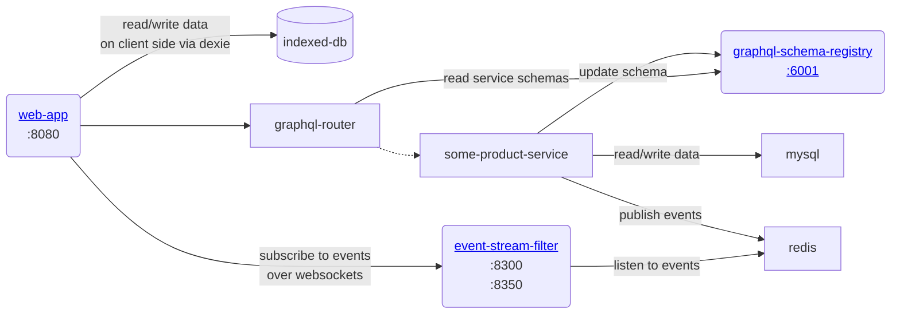
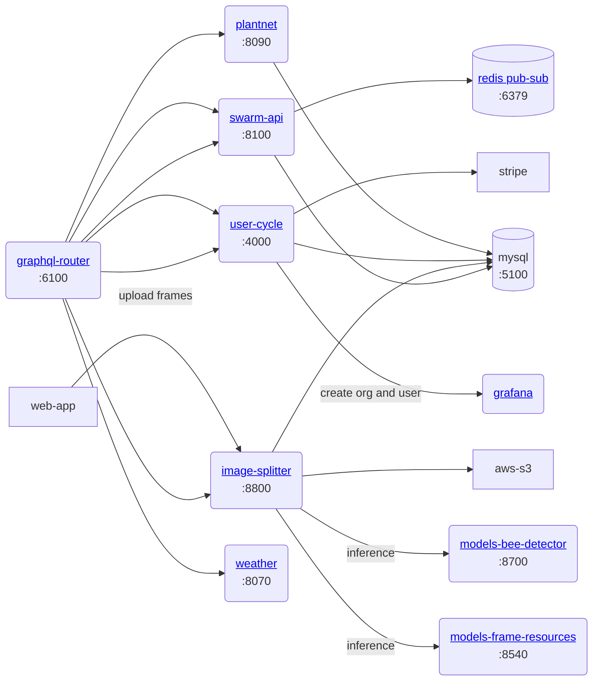
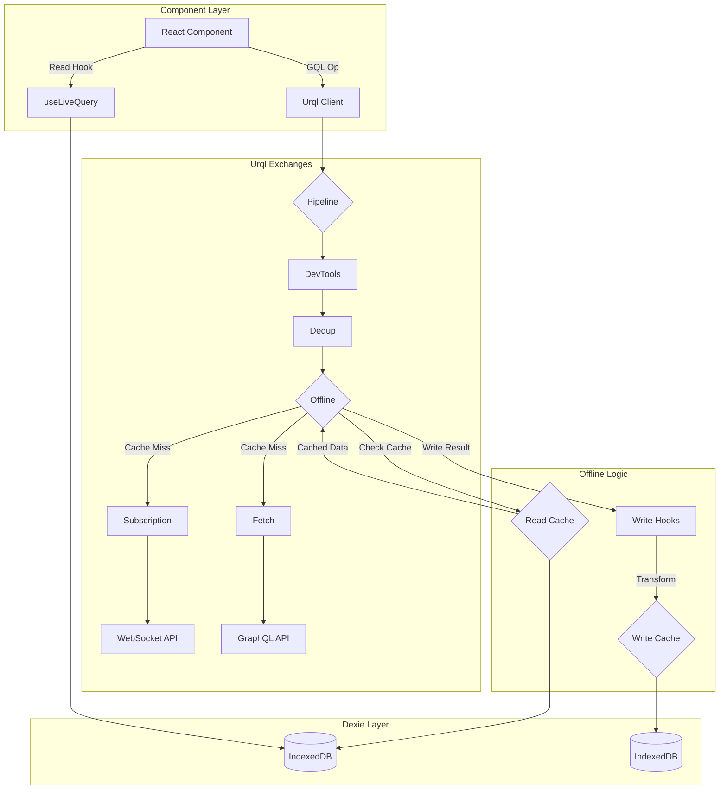

# Gratheon Web Application

[](https://www.gnu.org/licenses/agpl-3.0)

Frontend application for the Gratheon beehive management and analytics platform. Built with Preact, Vite, Urql, and Dexie for offline support.

See [product feature and ideas](https://gratheon.com/about/products/web_app/), also see technical [architecture docs]([https://gratheon.com/docs/web-app/](https://gratheon.com/docs/%F0%9F%93%B1%20Web-app/)) for the entire system


**Live Application:** [https://app.gratheon.com/](https://app.gratheon.com/)


## Table of Contents

- [Overview](#overview)
- [Getting Started](#getting-started)
  - [Prerequisites](#prerequisites)
  - [Installation](#installation)
  - [Running the Application](#running-the-application)
- [Architecture](#architecture)
  - [High-Level Frontend Architecture](#high-level-frontend-architecture)
  - [Component Structure](#component-structure)
  - [State Management & Data Flow (Urql + Dexie)](#state-management--data-flow-urql--dexie)
  - [Backend Interaction](#backend-interaction)
  - [Tech Stack](#tech-stack)
- [Project Structure](#project-structure)
- [Configuration](#configuration)
- [Available Scripts](#available-scripts)
- [Testing](#testing)
  - [Unit Tests](#unit-tests)
  - [End-to-End (E2E) Tests](#end-to-end-e2e-tests)
- [Deployment](#deployment)
- [Contributing](#contributing)
- [License](#license)
- [Support](#support)

## Overview

This repository contains the source code for the Gratheon web application frontend. Gratheon aims to provide comprehensive beehive management and analytics solutions for beekeepers. This web application serves as the primary user interface for interacting with the platform's data and features.

Users can manage their apiaries and hives, log detailed inspections, upload and analyze frame photos (leveraging backend AI services like `image-splitter`), track environmental conditions (via `weather` service integration), manage billing (`user-cycle`), and potentially monitor hive entrances (`entrance-observer`). The application interacts with a suite of backend microservices through a federated GraphQL API.

**Key Features:**

*   Apiary and Hive Management
*   Inspection Logging and Tracking
*   Data Visualization (Charts via Recharts)
*   Mapping of Apiaries/Hives (Leaflet)
*   Offline Data Access and Synchronization (Urql + Dexie)
*   Real-time Updates (GraphQL Subscriptions via WebSockets)
*   Image Upload and Annotation Capabilities
*   **Hive Edit View:** Visual representation of hive boxes and frames, including indicators for bee population density calculated between adjacent frames.

## Getting Started

### Prerequisites

*   Node.js: Version 20 (as specified in `.nvmrc`).
*   nvm (Node Version Manager): Recommended for managing Node.js versions. [Install nvm](https://github.com/nvm-sh/nvm#installing-and-updating).
*   just: A command runner used for simplifying common tasks. [Install just](https://github.com/casey/just#installation).
*   Docker & Docker Compose: Required *only* if running the full stack locally (including backend services).

### Installation

Clone the repository:
```bash
git clone https://github.com/Gratheon/web-app.git
```

Navigate to the project directory:
```bash
cd web-app
```

Use the correct Node.js version:
```bash
nvm use
```

Install dependencies:
```bash
npm install
```

### Running the Application

#### Development (Frontend Only)

This is the quickest way to work on UI components. It connects to the **production** backend API.

```bash
just start
```

Open [http://localhost:8080/](http://localhost:8080/) in your browser. You can log in using your existing credentials from `app.gratheon.com`.

#### Development (Full Stack Local)

This mode connects the frontend to locally running backend services.

1.  Configure Frontend: Modify `web-app/src/uri.ts` and set `USE_PROD_BACKEND_FOR_DEV` to `false`.
2.  Run Backend Services: Ensure all required backend microservices (GraphQL Router, Event Stream Filter, etc.) are running locally. Refer to the main project documentation or the root `Makefile`/`docker-compose` files for instructions (e.g., potentially `make dev` in the project root). You might need to adjust configuration in individual backend services.
3.  Run Frontend:
    ```bash
    just start
    ```
    The application will now communicate with your local backend services.

#### Development (Desktop App via Tauri)

This mode runs the web application within a native desktop window using [Tauri](https://tauri.app/v1/guides/getting-started/prerequisites). It allows testing desktop-specific integrations.

```bash
just dev-desktop-app
```

to build the app:
```bash
just build-desktop-app
```


## Configuration

*   API Endpoints: Configured primarily in `src/uri.ts`. The `USE_PROD_BACKEND_FOR_DEV` flag controls whether to target production or local backend services during development.
*   Environment Variables: While not explicitly listed, Vite supports standard `.env` file conventions (`.env`, `.env.local`, `.env.development`, `.env.production`) for build-time environment variables. Check `vite.config.ts` for usage.

## Available Scripts

Common tasks are managed via `npm` scripts (defined in `package.json`) and `just` commands (defined in `justfile`).

*   `just start` or `npm run dev`: Starts the Vite development server (hot-reloading enabled).
*   `npm run build`: Creates an optimized production build in the `dist/` folder.
*   `npm run build-clean`: Removes contents of the `public/` directory.
*   `npm run build-move`: Moves contents from `dist/` to `public/` (likely part of a build pipeline).
*   `npm run preview`: Serves the production build locally for previewing.
*   `npm run prettier`: Formats code using Prettier.
*   `just test-ui-headless`: Runs Playwright E2E tests in headless mode.
*   `just test-ui-create`: Interactively generates boilerplate for a new Playwright test.
*   `npm run test` / `npm run test:unit`: Runs unit tests using Vitest.
*   `just build-desktop-app`: Builds the Tauri desktop application for production.

## Testing

### Unit Tests

*   Framework: [Vitest](https://vitest.dev/) is used for unit and component testing, leveraging the Vite build pipeline for speed. Configuration is integrated within `vite.config.ts`.
*   Libraries: Tests utilize `@testing-library/react` for rendering components and interacting with the DOM, and `@testing-library/jest-dom` for DOM-specific assertions.
*   Running Tests:
    *   Run all unit tests: `npm run test:unit` or `npm test`
    *   Run tests in watch mode with UI: `npm run test:ui`
*   Location: Unit tests are typically co-located with the source code they test (e.g., `src/models/user.test.ts`).
*   Current Status: Basic unit tests exist, but more comprehensive coverage is needed. Contributions are welcome.

### End-to-End (E2E) Tests

*   Framework: Playwright (`test/ui/`) is used for browser automation testing.
*   Running Tests:
    *   Headless: `just test-ui-headless`
    *   Interactive (headed): Run Playwright commands directly or use VS Code Playwright extension.
*   Creating Tests: `just test-ui-create`
*   CI Status: E2E tests are not currently integrated into a CI pipeline.

## Deployment

*   The application is containerized using Docker (`Dockerfile`).
*   The `config/nginx.conf` suggests deployment behind an Nginx reverse proxy, likely serving the static build assets and potentially proxying API requests.
*   Deployment specifics (CI/CD pipeline, hosting environment) are not detailed in this repository.


#### Production Build

This command compiles and optimizes the application for production.

```bash
npm run build
```

Static assets will be generated in the `dist/` directory (which might be moved to `public/` by subsequent scripts like `build-move`).

#### Previewing Production Build

This command serves the production build locally using Vite's preview server.

```bash
npm run preview
```


## Architecture

### High-Level Frontend Architecture

This application is a Single Page Application (SPA) built with Preact/React and Vite. It utilizes Urql for GraphQL communication and Dexie for robust offline data storage via IndexedDB.


### Core services

The following services are mandatory, you will need to git-checkout them and start in the following order:

- mysql ← provides storage for other node and go services
- redis ← provides a pub-sub and caching layer
- graphql-schema-registry ← stores graphql schema of microservices
- graphql-router ← routes API requests to other microservices using a [graphql federation](https://www.apollographql.com/docs/federation/), which basically means that requests are split and routed to the microservice that is responsible for particular part of the schema

### Core services and routing




### Product services

- go-api ← main service that manages domain entities like apiary, hive, hive section, frame, frame side
- image-splitter ← main service that manages image processing + stores data on the detected objects in the frame photo

Note that some service may still be in development and can be unstable or only in draft phase (video processing for example)




### Component Structure

*   Layouts (`src/page/index.tsx`): Defines the main page structures based on authentication state (`LoggedInPage`, `PageWithMenu`, `LoggedOutPage`).
*   Pages (`src/page/*`): Represent distinct views or routes within the application (e.g., `ApiaryList`, `HiveEdit`, `InspectionShare`).
*   Shared Components (`src/shared/*`): Reusable UI elements used across multiple pages (e.g., `Button`, `Header`, `Map`, `Loader`, `VisualForm`).

### State Management & Data Flow (Urql + Dexie)

The application employs an **offline-first** state management strategy centered around **Dexie.js** (an IndexedDB wrapper) as the primary data store, integrated with **Urql** for GraphQL communication. This approach minimizes temporary state within components and reduces the need for extensive prop drilling.

**Core Principles:**

1.  Dexie as the Global Offline State: Dexie manages a client-side IndexedDB database (`gratheon`). This database acts as the central, persistent state container for application data (apiaries, hives, inspections, etc.), making it accessible even when offline.
2.  Minimize Component State: We strive to avoid storing fetched data or complex state directly within component state (`useState`, `useReducer`). Instead, components rely on accessing data from the Dexie cache.
3.  Reduce Prop Drilling: By treating Dexie as the global state, components can fetch the data they need directly, rather than receiving it through multiple layers of props.

**Data Flow:**

1.  Data Fetching (Urql): Components use adapted Urql hooks (`useQuery`, `useMutation`, `useSubscription` from `src/api/index.ts`) to request data or perform mutations.
2.  Custom Urql Exchange (`offlineIndexDbExchange`): A custom Urql exchange (`src/api/offlineIndexDbExchange.ts`) intercepts these operations.
    *   Network-First Attempt: It first attempts to fetch data from the network via the GraphQL API.
    *   Cache Update: If the network request succeeds, the response data is processed by `writeHooks` (`src/models/db/writeHooks.ts`). These hooks normalize the data and use Dexie functions (`upsertEntity`, etc. from `src/models/db/index.ts`) to write the fresh data into the appropriate IndexedDB tables.
    *   Offline Fallback: If the network request fails (e.g., user is offline), the exchange executes the GraphQL query against custom `resolvers` (`src/api/resolvers.ts`) which read data directly from the Dexie (IndexedDB) cache.
3.  Data Storage (Dexie): Dexie (`src/models/db/index.ts`) manages the IndexedDB tables. The schema for these tables is dynamically generated on application startup (`syncGraphqlSchemaToIndexDB` in `src/app.tsx`) based on the GraphQL schema (`src/api/schema.ts`), ensuring alignment between the backend and the client-side cache.
4.  UI Updates: Components typically access data via the Urql hooks. Because the `offlineIndexDbExchange` ensures the Dexie cache is updated and serves as a fallback, these hooks effectively provide components with data sourced primarily from Dexie, whether fetched initially from the network or retrieved directly from the cache when offline. Direct Dexie hooks like `useLiveQuery` might also be used in some places for reactive updates directly from the database.

This architecture ensures data persistence, enables offline functionality, and promotes a clean separation between data management and component logic.

**Specific Data Models:**

While the schema is dynamically generated, specific models (`src/models/*.ts`) often provide:
*   TypeScript interfaces for data structures.
*   Helper functions for common data operations or transformations.
*   Dedicated functions for interacting with specific Dexie tables, encapsulating logic beyond simple upserts handled by write hooks.

**Example: `FrameSideInspection` Model**

*   **Purpose:** Manages historical data for individual frame sides captured during a specific inspection.
*   **Storage:** Data is stored in the `frame_side_inspection` Dexie table.
*   **Population:** The table is automatically populated via the `FrameSideInspection` write hook (`src/models/db/writeHooks.ts`) when inspection data is fetched from the backend. This hook uses the `upsertFrameSideInspection` function from the model.
*   **Access:** Components should retrieve this data using the local `frameSidesInspections` GraphQL query (`src/api/resolvers.ts`), which in turn uses the `listFrameSideInspectionsByInspectionId` function from the model to read from Dexie. This provides a structured way to access inspection-specific frame side details (like associated files and cell data) for offline use.



### Tech Stack

| Dependency           | Version | Why                                                              |
| -------------------- | ------- | ---------------------------------------------------------------- |
| **Framework**        |         |                                                                  |
| Preact               | ^10.23  | High-performance UI library with React compatibility             |
| React (Compatibility)| ^18.3   | Used via Preact compatibility layer                              |
| **Build & Dev**      |         |                                                                  |
| Vite                 | ^5.4    | Fast build tool and development server                           |
| TypeScript           | ^5.5    | Static typing for improved code reliability and maintainability  |
| **Routing**          |         |                                                                  |
| React Router         | ^6.6    | Standard library for client-side routing in React applications   |
| **GraphQL Client**   |         |                                                                  |
| Urql                 | ^3.0    | Performant and extensible GraphQL client (chosen over Apollo for smaller bundle size and Relay for less opinionated API) |
| graphql-ws           | ^5.11   | Client for GraphQL subscriptions over WebSockets                 |
| **Offline Storage**  |         |                                                                  |
| Dexie                | ^3.2    | Wrapper for IndexedDB, simplifying client-side database operations |
| dexie-react-hooks    | ^1.1    | React hooks for integrating Dexie live queries                   |
| **Styling**          |         |                                                                  |
| Less                 | ^4.2    | CSS preprocessor, used with CSS Modules                          |
| **Utilities**        |         |                                                                  |
| date-fns             | ^2.30   | Modern JavaScript date utility library                           |
| lodash               | ^4.17   | Utility library for common programming tasks                     |
| **Mapping**          |         |                                                                  |
| Leaflet              | ^1.9    | Interactive map library                                          |
| React Leaflet        | ^4.2    | React components for Leaflet maps                                |
| **Charting**         |         |                                                                  |
| Recharts             | ^2.12   | Composable charting library built with React                     |
| **Error Reporting**  |         |                                                                  |
| Sentry               | ^8.26   | Error tracking and performance monitoring                        |
| **Analytics**        |         |                                                                  |
| Posthog              | ^1.2    | Product analytics, User behavior analytics (heatmaps, session recordings)                                                |
| **Testing**          |         |                                                                  |
| Playwright           | ^1.46   | End-to-end testing framework                                     |
| Vitest               | ^3.1    | Fast unit testing framework, integrated with Vite                |
| @testing-library/react | ^16.0   | Utilities for testing React components                           |
| @testing-library/jest-dom | ^6.4 | Custom matchers for asserting on DOM nodes                     |
| Playwright           | ^1.46   | End-to-end testing framework                                     |

## Project Structure

```
web-app/
├── config/                 # Deployment configurations (e.g., Nginx)
├── public/                 # Static assets served directly (output of build often moved here)
├── src/                    # Main application source code
│   ├── api/                # GraphQL client (Urql), exchanges, offline logic
│   ├── assets/             # Images, icons, fonts
│   ├── config/             # Application runtime configuration
│   ├── hooks/              # Custom React hooks
│   ├── icons/              # SVG icon components
│   ├── models/             # TypeScript types and interfaces, Dexie DB setup
│   │   └── db/             # Dexie database schema, hooks, setup
│   ├── page/               # Top-level page components and routing logic
│   ├── shared/             # Reusable UI components (Button, Map, etc.)
│   ├── styles/             # Global styles (though most are CSS Modules)
│   ├── app.tsx             # Root application component
│   ├── main.tsx            # Application entry point (renders App)
│   ├── index.css           # Global CSS entry point
│   ├── uri.ts              # URI/endpoint management
│   └── user.ts             # User session/authentication helpers
├── test/                   # Test configurations and utilities
│   └── ui/                 # Playwright E2E tests
├── .env                    # Environment variables (if any, not checked in)
├── .gitignore              # Files ignored by Git
├── .nvmrc                  # Specifies Node.js version
├── Dockerfile              # Docker image definition for deployment
├── docker-compose.yml      # Docker Compose for production-like environments
├── docker-compose.dev.yml  # Docker Compose for local development
├── justfile                # Command definitions for 'just' runner
├── package.json            # Project metadata and dependencies
├── tsconfig.json           # TypeScript compiler configuration
└── vite.config.ts          # Vite build tool configuration
```

## License

This project is **dual-licensed**:

- **[AGPL v3](LICENSE-AGPL.md)** - For open source use
- **[Commercial License](LICENSE-COMMERCIAL.md)** - For enterprise customers

### Open Source License (AGPL v3)

The open source version is licensed under the GNU Affero General Public License v3. This means:

- ✅ You can use, modify, and distribute the software
- ✅ Source code is freely available
- ⚠️ If you modify and host a public instance, you must share your modifications
- ⚠️ Any derivative work must also be licensed under AGPL v3

See [LICENSE-AGPL.md](LICENSE-AGPL.md) for full terms.

### Commercial License

For enterprise customers who need:
- 🏢 On-premise deployment without source disclosure
- 🔧 Custom modifications without copyleft obligations
- 🎨 White-label/rebranding rights
- 📞 Priority support and SLA guarantees

Contact us at [pilot@gratheon.com](mailto:pilot@gratheon.com) for commercial licensing options.

### Contributing

If you'd like to contribute, please see our [Contributing Guide](CONTRIBUTING.md) and sign our Contributor License Agreement (CLA).

*   Please refer to the `CODEOWNERS` file for ownership details.
*   Code style is enforced by Prettier (`npm run prettier`).
*   Follow standard GitHub flow: Fork the repository, create a feature branch, make changes, and submit a Pull Request.


## Support

For issues, questions, or support, please refer to the main Gratheon project communication channels or open an issue in this repository.
