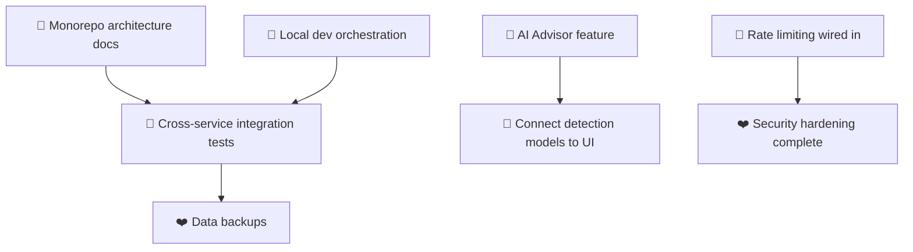

# Gratheon Platform - Development TODO

## Priority Legend

| Emoji | Meaning | When to work on it |
|-------|---------|-------------------|
| ❤️ | Critical — blocks platform viability or security | Do now |
| 💛 | High — accelerates velocity, significant ROI | Next sprint |
| 💚 | Quality — technical debt, compounds over time | Backlog rotation |
| 💙 | Nice-to-have — polish and optimization | When nothing else pulls you |

---

## Platform Infrastructure (Monorepo)

### ❤️ Add monorepo dev orchestration with `justfile` or `docker-compose.override.yml`
**Why**: Each service has its own docker-compose.dev.yml but there is no single entrypoint to start the full local stack. Developers must manually start 16+ services in correct order, manage shared networks (gratheon), and handle env vars across services.

**What to do**: Create a root-level `justfile` with targets like:
- `just dev-start` — starts all core services (swarm-api, graphql-router, web-app, user-cycle, alerts) in dependency order
- `just dev-stop` / `just dev-clean` 
- `just test` — runs tests across all services

**Effort**: 2-3 days  
**Impact**: Onboards new developers from hours to minutes. Reduces "works on my machine" issues.

### 💛 Implement cross-service integration testing
**Why**: GraphQL federation spans 16+ microservices (swarm-api, user-cycle, alerts, weather, plantnet, telemetry-api, event-stream-filter). A schema change in one service can silently break others. Currently there are zero integration tests between services.

**What to do**: 
- Create `integration-tests/` directory with Docker Compose profiles
- Write tests that verify GraphQL federation queries across services (e.g., query hives → join with weather → join with telemetry data)
- Use test containers or mock services where real DBs aren't available
- Target: 10-15 integration test scenarios covering critical paths

**Effort**: 5-7 days  
**Impact**: Catches breaking changes before they reach staging. Essential for safe refactoring of federation schema.

### 💛 Add root-level CI/CD workflow with matrix builds
**Why**: Each service has its own `.github/workflows/*` but no coordinated pipeline. No shared caching, no dependency validation across services, no single view of platform health.

**What to do**: Create `.github/workflows/platform.yml` that:
- Runs all service tests in parallel matrix
- Shares build cache between runs (Docker layers, Go modules, pnpm store)
- Validates GraphQL schema compatibility across services on PRs
- Triggers deploy pipelines only when relevant services changed

**Effort**: 3-4 days  
**Impact**: Faster CI, better DX, prevents cross-service regressions.

---

## web-app (Frontend) — 65K lines, only 7.7% test coverage

### 💛 Enable Playwright E2E tests with local backend
**Why**: `playwright.config.ts` exists but `webServer` is commented out. The project has all the pieces for E2E testing but they can't run without a running backend stack. This leaves critical user flows untested: hive creation, device viewing, apiary management.

**What to do**:
- Uncomment and configure `webServer` in playwright.config.ts to start local dev server
- Write first E2E tests for: login flow, create hive, view hive dashboard, upload inspection photo
- Add CI integration so E2E runs on PRs

**Effort**: 3-4 days  
**Impact**: First real safety net for frontend changes. Currently the only "test" is unit tests for utility functions.

### 💛 Implement AI Advisor feature (currently a stub)
**Why**: `web-app/src/page/aiAdvisor/index.tsx` is ~128 lines — just a placeholder UI. This is positioned as a core differentiator: ML-powered bee health insights from frame photos. The backend models exist (models-queen-bee-detector, models-varroa-on-bee) but aren't connected.

**What to do**:
1. Connect frontend to image-splitter upload API (already exists)
2. Wire up model inference pipeline: frame photo → image-splitter job queue → varroa/queen detection results
3. Display analysis results in the UI with visual overlays
4. Add treatment recommendations based on detected issues (varroa count, queen status)
5. Integrate with hive inspection workflow — one-click from inspection view

**Effort**: 10-15 days  
**Impact**: Key differentiator for commercial tier. Directly tied to revenue potential.

### 💚 Add PWA offline support verification tests
**Why**: README mentions Dexie (offline DB) and VitePWA plugin, but no tests verify the offline experience works correctly — data sync, stale-while-revalidate behavior, push notifications on reconnect.

**What to do**:
- Write tests that simulate offline → online transitions
- Verify local Dexie writes persist and sync when reconnected
- Test PWA installability and service worker updates

**Effort**: 2-3 days  
**Impact**: Beekeepers work in fields with poor connectivity — this is a real usability requirement, not just a nice-to-have.

### 💚 Performance: audit and reduce initial bundle size
**Why**: 440 files with Preact + Vite should produce a lean bundle, but no analysis has been done. No code splitting by route visible in vite.config.ts beyond the default. Potential for large initial load on mobile networks (primary beekeeper connection).

**What to do**:
- Run `vite build --report` to analyze current bundle composition
- Add route-based code splitting for heavy pages: inspectionList, warehouse, grafana, aiAdvisor
- Lazy-load map components (likely large) and Grafana iframe embeds
- Audit and remove unused dependencies

**Effort**: 2-3 days  
**Impact**: Direct UX improvement for beekeepers on slow mobile connections.

---

## Backend Services — Critical Gaps

### ❤️ Add tests for entrance-observer (edge AI inference)
**Why**: This service runs on Jetson Orin/Nano with GPU-accelerated video processing for real-time hive entrance monitoring. Zero tests exist. A regression here means false bee activity counts or missed detections in production — directly impacts apiary owners' decisions.

**What to do**:
- Unit test the float detection pipeline (best_float32.tflite model loading and inference)
- Integration test: video chunk → frame extraction → model inference → result aggregation
- Mock GPU operations for CI; run actual TFLite on Jetson for local validation
- Add performance benchmarks: ms per frame at target resolution

**Effort**: 5-7 days  
**Impact**: Core edge AI service with zero safety net. Production impact if broken.

### 💛 Implement data backup strategy for all databases
**Why**: Platform relies on MySQL (swarm-api, plantnet), ClickHouse (clickstack), Redis (rate-limiter), InfluxDB (telemetry). No automated backups visible anywhere. Data loss = lost apiary records, telemetry history, and user data.

**What to do**:
- Add backup cron jobs for each database type in respective docker-compose configs
- Use pg_dump / mysqldump / ch-backup / redis-cli RDB snapshots
- Store backups in S3 with lifecycle policies (30/90/365 day retention)
- Document and test restore procedures

**Effort**: 3-4 days  
**Impact**: Prevents catastrophic data loss. Insurance policy for the entire platform.

### 💚 Add rate limiting to all GraphQL endpoints
**Why**: `rate-limiter` service exists (Redis token bucket) but no evidence it's wired into graphql-router or any other service. Without it, a single client can hammer APIs — especially dangerous for: user-cycle auth endpoints (brute force), image-splitter uploads (resource exhaustion).

**What to do**:
- Wire rate-limiter middleware into graphql-router
- Define per-endpoint limits: auth endpoints (strict), uploads (moderate), read queries (generous)
- Add monitoring: track how many users hit limits, alert on spikes
- Document rate limit headers in API responses

**Effort**: 3-4 days  
**Impact**: Security hardening + protection against accidental DoS.

### 💚 Standardize logging with shared log-lib across all services
**Why**: Three separate logging libraries (log-lib for TS, log-lib-go, log-lib-py) with potential format inconsistencies. No distributed tracing IDs connecting logs across service boundaries. Debugging issues across the federation requires manual correlation.

**What to do**:
- Audit current log formats in each service
- Align on a single structured JSON schema with trace_id, span_id, service_name fields
- Add OpenTelemetry context propagation for distributed traces
- Create shared format validation tests

**Effort**: 3-4 days  
**Impact**: Cuts mean time to resolution for production issues by orders of magnitude.

---

## ML / Detection Models (Plantnet, Varroa, Queen Detector)

### 💛 Connect detection models to web-app UI
**Why**: Three detection models exist and are trained: queen bee detector (mAP50=0.92), varroa-on-bee detector, plantnet species classifier. But they're isolated — no pipeline from "user uploads frame photo" → "get analysis results back in the hive edit view."

**What to do**:
1. Create unified inference API gateway or extend image-splitter job queue
2. Add model result types to GraphQL schema (FrameAnalysis, VarroaCount, PlantSpecies)
3. Build UI components: detection overlays on frame photos, result cards with confidence scores
4. Wire into inspection workflow: auto-trigger analysis when photo uploaded

**Effort**: 7-10 days  
**Impact**: Activates the entire ML stack that's been built but never exposed to users.

### 💚 Add model monitoring and drift detection
**Why**: Models are trained offline with no feedback loop. Varroa counts from field photos need validation against actual treatments applied by beekeepers. No way to know if models are degrading over time (seasonal changes, different bee breeds, lighting conditions).

**What to do**:
- Log all model predictions with metadata (date, location, weather, hive age)
- Add user feedback mechanism: "Was this varroa count accurate?" 
- Track prediction distributions over time — alert on significant shifts
- Periodic retraining pipeline triggered by drift detection or quarterly schedule

**Effort**: 5-7 days  
**Impact**: Ensures ML predictions stay reliable as conditions change. Builds trust with users.

---

## Documentation & Developer Experience

### 💚 Create monorepo architecture documentation
**Why**: 20+ components, GraphQL federation, shared networks, multiple DBs. No single document explains how they fit together. New contributors struggle to understand the system. README files exist but are outdated (web-app's mentions "440+ files" in docs written when it had fewer).

**What to do**:
- Create `ARCHITECTURE.md` at root with service map, data flow diagrams, API contract overview
- Document deployment topology: which services run where, shared infrastructure
- Add per-service quickstart guides linking to full READMEs
- Keep diagrams as Mermaid in markdown for version control

**Effort**: 2-3 days  
**Impact**: Dramatically reduces onboarding time. Single source of truth for system design decisions.

### 💚 Add CONTRIBUTING.md with local dev setup guide
**Why**: No visible developer onboarding document. Each service has its own setup instructions but no unified guide. Setting up the full development environment likely takes hours of trial and error.

**What to do**:
- Document prerequisites (Go, Node 24 via nvm, Docker, Just)
- Step-by-step: clone → init shared network → start core services → run web-app dev
- Common issues and solutions section
- Code style conventions (linting, formatting, commit message format)

**Effort**: 1-2 days  
**Impact**: Reduces first-day friction for any contributor or new team member.

---

## Timeline & Dependencies

**Suggested order**:
1. **Week 1-2**: Monorepo dev orchestration + architecture docs (foundation for everything else)
2. **Week 3-4**: Integration tests + data backups (safety net)
3. **Week 5-8**: AI Advisor feature + model integration (revenue-generating work)
4. **Week 9+**: Performance, monitoring, remaining quality items

---

## Notes on Current State (2026-07-11)

| Area | Status | Coverage |
|------|--------|----------|
| web-app (frontend) | 440 files / 65K lines | 34 tests (7.7%) |
| swarm-api (GraphQL core) | Active development | 29 tests |
| user-cycle (auth/billing) | Feature-complete | 395 tests |
| image-splitter (ML pipeline) | Production service | 469 tests |
| event-stream-filter (WebSocket) | Active dev | 33 tests |
| entrance-observer (edge AI) | Edge deployment | **0 tests** |
| plantnet / models | Trained, not connected | **0 tests each** |
| CI/CD | Per-service workflows | Missing cross-service validation |
| E2E testing | Playwright configured but disabled | Cannot run without backend |
