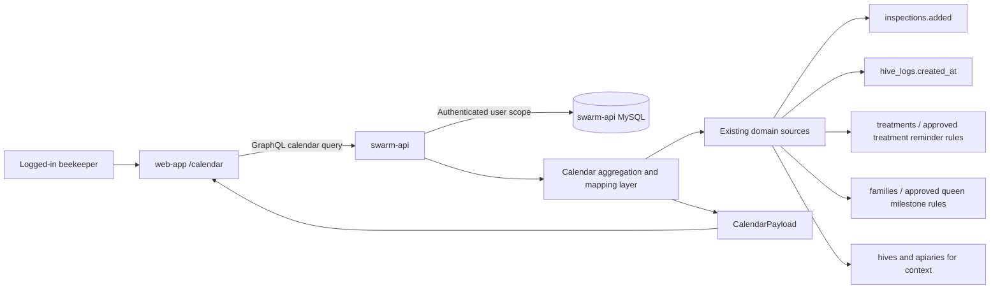
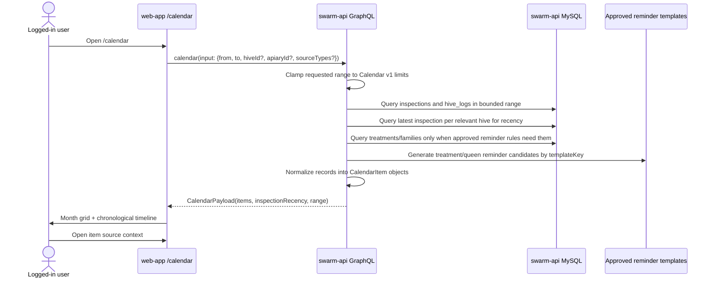
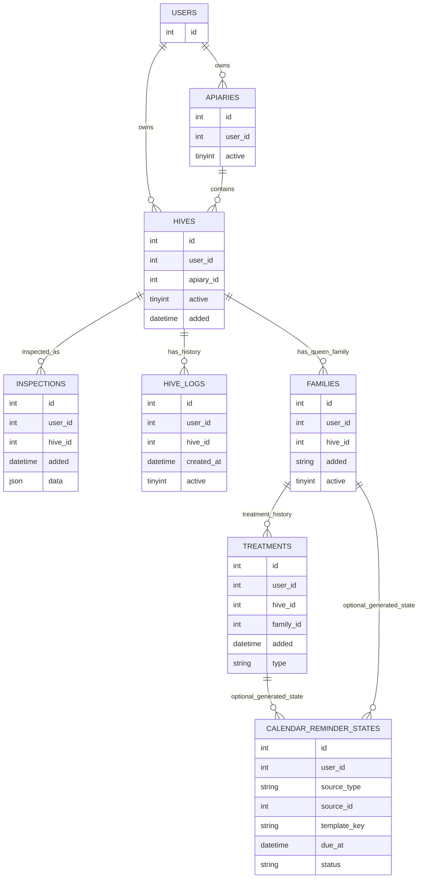

Specification: Calendar

## Architecture

### Architecture recommendation

Calendar v1 should keep its backend data ownership and aggregation in `swarm-api`, not in a new microservice.

Rationale:

- Calendar v1 is an authenticated product view over existing beekeeping domain records already owned by `swarm-api`: apiaries, hives, inspections, hive logs, treatments, and queen/family records.
- `swarm-api` already owns GraphQL access control, user scoping, SQL migrations, and domain model joins for these records.
- A separate Calendar microservice in v1 would add distributed auth, duplicated read models, cross-service synchronization, and failure modes before Calendar needs independent scaling or independent lifecycle ownership.
- Calendar v1 explicitly avoids a generic scheduling/workflow engine, external calendar provider sync, and notification redesign, so a new service boundary is not yet justified.

A separate calendar/reminder microservice should be reconsidered only if a later approved scope adds at least one of: external calendar provider sync, high-volume asynchronous reminder generation, notification delivery orchestration, recurring workflow engines, or a calendar data lifecycle independent from beekeeping source records.

### System context diagram



### Calendar data-flow diagram



### Data ownership diagram



### Data ownership and storage plan

- Existing source tables remain the source of truth for historical Calendar records. Calendar v1 must not copy inspections or hive logs into a separate `calendar_events` table for display-only history.
- `swarm-api` should add read-oriented SQL queries and indexes for bounded date ranges instead of requiring the web-app to fan out through multiple existing page-specific GraphQL queries.
- Generated treatment and queen reminder templates may be represented as server-side code/config with stable `templateKey` values first. User-visible copy should remain localized in the web-app using existing translation patterns.
- A persistent `calendar_reminder_states` table is only needed when generated reminders need user-specific lifecycle state such as dismissed, done, or snoozed. It should store state for generated reminders, not duplicate historical source records.
- Calendar v1 should avoid a generic recurrence table or workflow engine unless future scope explicitly approves that expansion.

### Proposed database changes in `swarm-api`

Calendar v1 can start with existing source tables plus indexes. Reminder state tables are conditional on approving treatment and queen reminder lifecycle behavior.

#### Required read indexes for Calendar v1 aggregation

#### Treatment reminder data contract (Approved)

Current treatment data is too thin for safe automatic reminder generation. The treatment logging form and `treatments` table will be updated to store:

- `applied_at`: A date separate from row creation time, allowing users to accurately log past treatments.
- `template_key`: A selected category/template key from an approved set (e.g., `MITE_TREATMENT_FOLLOWUP`, `FEED_REFILL_CHECK`, `WINTER_PREP_CHECK`).
- `due_at`: A follow-up due date explicitly entered by the user or pre-filled by the UI based on the `template_key`.
- `product_notes`: Optional informational text field that does not encode veterinary or regulatory instructions.

Reminder generation will use **stateless generation**. Persistent state in `calendar_reminder_states` (like DISMISSED or SNOOZED status) is explicitly deferred. Reminders are generated on-the-fly for treatments having a `due_at` within the queried Calendar date range.

#### Localization and Legal Copy Constraints

- Treatment reminder text must be localized in the web-app using the `template_key`.
- Copy must be strictly informational (e.g., "Check mite treatment progress") and must include a legal disclaimer key warning that it does not replace product-label, veterinary, or regulatory instructions.

#### Item Identity Conventions

Stateless treatment reminders will use a stable ID convention to prevent UI re-rendering glitches: `treatment-reminder:{treatmentId}:{templateKey}:{due_at}`. Source metadata must include the `treatmentId`, `hiveId`, and `apiaryId` to allow linking back to the treatment context.
| `hives` | `(user_id, active, apiary_id)` | Efficient Calendar context filtering by active hives/apiaries. |

#### Conditional reminder state table

Create this only if generated reminders need persistent user-specific state. If Calendar v1 only displays stateless generated candidates, this table can be deferred.

```sql
CREATE TABLE calendar_reminder_states (
  id INT UNSIGNED NOT NULL AUTO_INCREMENT,
  user_id INT UNSIGNED NOT NULL,
  source_type ENUM('TREATMENT', 'FAMILY') NOT NULL,
  source_id INT UNSIGNED NOT NULL,
  template_key VARCHAR(80) NOT NULL,
  due_at DATETIME NOT NULL,
  status ENUM('SCHEDULED', 'DONE', 'DISMISSED', 'SNOOZED') NOT NULL DEFAULT 'SCHEDULED',
  snoozed_until DATETIME NULL,
  metadata JSON NULL,
  dedupe_key VARCHAR(255) NOT NULL,
  created_at DATETIME NOT NULL DEFAULT CURRENT_TIMESTAMP,
  updated_at DATETIME NOT NULL DEFAULT CURRENT_TIMESTAMP ON UPDATE CURRENT_TIMESTAMP,
  PRIMARY KEY (id),
  UNIQUE KEY uniq_calendar_reminder_states_user_dedupe (user_id, dedupe_key),
  KEY idx_calendar_reminder_states_user_due (user_id, due_at, status),
  KEY idx_calendar_reminder_states_user_source (user_id, source_type, source_id)
) ENGINE=InnoDB DEFAULT CHARSET=utf8mb4 COLLATE=utf8mb4_unicode_ci;
```

#### Treatment reminder data contract before implementation

Current treatment data is too thin for safe automatic reminder generation. Before implementing treatment reminders, approve whether treatment inputs will store:

- `applied_at` or equivalent date separate from row creation time, if users can backdate treatments.
- treatment category/template key selected from an approved set, or explicit user-entered follow-up due date.
- optional product/name/notes fields that are informational only and do not encode veterinary or regulatory instructions.
- reminder enablement/status rules, either stateless generation or persisted state in `calendar_reminder_states`.

#### Queen milestone data contract before implementation

Current queen/family `added` is a year string, which is enough for approximate age display but not enough for precise date milestones. Before implementing queen milestone reminders, approve whether queen/family records will store:

- exact `introduced_at` date for date-specific milestones, or
- year-only annual milestones with intentionally approximate due dates, or
- user-entered milestone due dates.

### Proposed GraphQL contract in `swarm-api`

Calendar should expose one aggregate query so the web-app can render Calendar without duplicating backend joins and access-control rules.

```graphql
enum CalendarItemKind {
  HISTORICAL_RECORD
  GENERATED_REMINDER
}

enum CalendarItemSourceType {
  INSPECTION
  HIVE_LOG
  TREATMENT_REMINDER
  QUEEN_MILESTONE
}

enum CalendarReminderStatus {
  SCHEDULED
  DONE
  DISMISSED
  SNOOZED
}

input CalendarInput {
  from: DateTime!
  to: DateTime!
  apiaryId: ID
  hiveId: ID
  sourceTypes: [CalendarItemSourceType!]
}

type CalendarRange {
  from: DateTime!
  to: DateTime!
  capped: Boolean!
}

type CalendarSourceContext {
  sourceType: CalendarItemSourceType!
  sourceId: ID
  hiveId: ID
  apiaryId: ID
  familyId: ID
  templateKey: String
}

type CalendarItemLabel {
  translationKey: String!
  fallback: String!
  args: JSON
}

type CalendarItem {
  id: ID!
  kind: CalendarItemKind!
  sourceType: CalendarItemSourceType!
  date: DateTime!
  label: CalendarItemLabel!
  details: CalendarItemLabel
  hive: Hive
  apiary: Apiary
  source: CalendarSourceContext!
  templateKey: String
  reminderStateId: ID
  reminderStatus: CalendarReminderStatus
  legalDisclaimerKey: String
}

type CalendarInspectionRecency {
  hive: Hive!
  latestInspection: Inspection
  latestAt: DateTime
  isInsideSelectedRange: Boolean!
}

type CalendarPayload {
  range: CalendarRange!
  items: [CalendarItem!]!
  inspectionRecency: [CalendarInspectionRecency!]!
}

# Add to the existing Query type in swarm-api/schema.graphql.
calendar(input: CalendarInput!): CalendarPayload!
```

The API should return stable `translationKey`, `templateKey`, and argument metadata so the web-app can keep user-visible labels localized with existing translation patterns. `fallback` is for safe display/debugging and should not replace localization review for generated reminder copy.

No Calendar mutation is required for read-only Calendar v1. If persistent reminder lifecycle state is approved later, add narrowly scoped mutations instead of a generic scheduler API:

```graphql
input SetCalendarReminderStatusInput {
  reminderStateId: ID
  sourceType: CalendarItemSourceType!
  sourceId: ID!
  templateKey: String!
  dueAt: DateTime!
  status: CalendarReminderStatus!
  snoozedUntil: DateTime
}

# Add to the existing Mutation type in swarm-api/schema.graphql.
setCalendarReminderStatus(input: SetCalendarReminderStatusInput!): Boolean!
```

### Calendar item identity conventions

Calendar item IDs should be stable and deterministic so the web-app can diff items predictably:

- Historical inspection item: `inspection:{inspectionId}`.
- Historical hive log item: `hive-log:{hiveLogId}`.
- Stateless generated treatment reminder: `treatment-reminder:{treatmentId}:{templateKey}:{dueDate}`.
- Stateless generated queen milestone: `queen-milestone:{familyId}:{templateKey}:{dueDate}`.
- Persisted reminder state, if introduced: `calendar-reminder-state:{id}` while still exposing source and template metadata.

## Requirements

**Functional requirements**

- [x] REQ-F-001 Provide a root-level Calendar entry point at `/calendar`. Verification: route and navigation tests.
- [x] REQ-F-002 Expose the current TimeView functionality at `/insights` instead of `/time`. Verification: route migration tests.
- [x] REQ-F-003 Remove the existing Grafana route currently exposed at `/insights` so the renamed TimeView has no route collision. Verification: route migration tests and code review.
- [x] REQ-F-004 Present both historical beekeeping activity and future reminders/tasks relevant to beekeeping operations in one calendar-oriented view. Verification: populated-state acceptance test.
- [x] REQ-F-005 Map each calendar item to a specific source record or to a specific generated reminder template. Verification: calendar item mapping tests.
- [x] REQ-F-006 Allow the user to open the related source context from a calendar item when the item is based on an existing record. Verification: navigation/link tests.
- [x] REQ-F-007 Limit Calendar v1 item sources to inspections, hive log entries, treatment-generated reminders, and queen milestone reminders. Verification: source filtering tests.
- [x] REQ-F-008 Distinguish generated reminders/tasks from historical records visually and textually. Verification: UI acceptance tests.
- [x] REQ-F-009 Define treatment reminder generation rules before implementation. Verification: approved specification update and reminder rule tests.
- [ ] REQ-F-010 Define queen milestone generation rules before implementation. Verification: approved specification update and milestone rule tests.
- [x] REQ-F-011 Keep seasonal tasks, administrative tasks, external calendar provider integrations, notification delivery redesign, generic workflow engines, broad brainstorm features, and replacement of existing TimeView telemetry/charting out of Calendar v1 unless later approved. Verification: code review and scope review.
- [x] REQ-F-012 Show inspection recency in Calendar v1 by displaying the latest known inspection date for the relevant hive/apiary context, even when that inspection falls outside the currently selected calendar date range. The recency indicator is based on an inspection source record, links to the related source context when available, and must not be presented as a future task. Verification: inspection recency UI and mapping tests.
- [x] REQ-F-013 Expose Calendar v1 data through a `swarm-api` GraphQL aggregate query that returns a normalized `CalendarPayload` for a requested bounded range and optional hive/apiary/source filters. Verification: GraphQL integration tests.
- [x] REQ-F-014 Include source metadata on every Calendar item sufficient for the web-app to open related source context without guessing from labels. Verification: item mapping and navigation tests.
- [x] REQ-F-015 Use stable deterministic Calendar item IDs for source records and stateless generated reminder candidates. Verification: calendar item identity tests.

**Non-functional requirements**

#### Performance

- [x] REQ-NF-PERF-001 Calendar initial render loads a bounded default date range from 4 weeks before today through 4 weeks after today; user-expanded calendar loading is capped to dates within 1 year before through 1 year after today. Initial item volume is limited to approved Calendar v1 sources within the selected date range, with no unbounded historical load. Verification: approved specification update and data-loading tests.
- [x] REQ-NF-PERF-002 Avoid loading unbounded historical records on initial render. Verification: code review and query/data-fetch tests.
- [x] REQ-NF-PERF-003 The inspection recency indicator may query only the latest inspection record per relevant hive/apiary context and must not require loading full inspection history outside the selected calendar range. Verification: data-fetch tests and code review.
- [x] REQ-NF-PERF-004 Add or verify SQL indexes in `swarm-api` for Calendar range queries and latest-inspection recency lookups before enabling server-side Calendar aggregation in production. Verification: migration review and query-plan tests.
- [x] REQ-NF-PERF-005 Enforce Calendar date-range caps in `swarm-api`, not only in the web-app. Verification: GraphQL resolver tests.

#### Security

- [x] REQ-NF-SEC-001 Require normal authenticated app access for Calendar. Verification: route access tests.
- [x] REQ-NF-SEC-002 Calendar is available to all logged-in users and is not restricted by subscription tier in Calendar v1. Verification: approved specification update and gate tests.
- [x] REQ-NF-SEC-003 Keep treatment reminder guidance informational only and do not imply replacement of product-label, veterinary, or regulatory instructions. Verification: copy review.
- [x] REQ-NF-SEC-004 Enforce user scoping for all Calendar source queries inside `swarm-api` and never return records from another user via source-context metadata. Verification: GraphQL authorization tests.

#### Quality

- [x] REQ-NF-QUAL-001 Include automated tests for route/menu visibility and approved date-mapping logic. Verification: test suite.
- [x] REQ-NF-QUAL-002 Cover at least one empty state and one populated state for the approved Calendar v1 scope. Verification: acceptance tests.
- [x] REQ-NF-QUAL-003 Verify that `/calendar` and `/insights` resolve to the intended pages and that the old Grafana `/insights` route no longer exists. Verification: route migration tests.
- [x] REQ-NF-QUAL-004 Cover inspection recency behavior for at least one hive/apiary with a latest inspection inside the selected range and one with a latest inspection outside the selected range. Verification: inspection recency tests.
- [x] REQ-NF-QUAL-005 Cover the `swarm-api` Calendar aggregate query with integration tests for bounded range, source filtering, stable item identity, source-context mapping, and user scoping. Verification: GraphQL integration test suite.

#### Complexity

- [x] REQ-NF-CPLX-001 Reuse existing routes, models, and translation patterns where practical. Verification: code review.
- [x] REQ-NF-CPLX-002 Avoid introducing a new generic scheduling system unless future reminders require one and that expansion is explicitly approved. Verification: architecture review.
- [x] REQ-NF-CPLX-003 Keep Calendar v1 backend aggregation inside `swarm-api`; do not create a dedicated Calendar microservice unless later scope adds external calendar sync, notification orchestration, high-volume async reminder generation, or independent Calendar data ownership. Verification: architecture review.
- [x] REQ-NF-CPLX-004 Avoid duplicating historical source records into a Calendar event store for Calendar v1; use normalized read mapping from source tables and optional reminder state only for generated reminder lifecycle. Verification: migration and model review.

#### Documentation

- [x] REQ-NF-DOC-001 Keep new menu labels, item labels, empty states, and warnings compatible with the existing translation approach using `T`-wrapped UI strings. Verification: code review and localization review.
- [ ] REQ-NF-DOC-002 Localize treatment reminder copy and keep it legally cautious if treatment reminders are approved for implementation. Verification: localization and copy review.
- [x] REQ-NF-DOC-003 Keep this specification as the source of truth for Calendar route decisions, Calendar v1 scope, source types, known risks, and pending follow-up requirements. Verification: review process.
- [x] REQ-NF-DOC-004 Keep the Calendar architecture, database sketch, and GraphQL contract in this specification updated before implementation changes are made. Verification: documentation review.

#### UX

- [x] REQ-NF-UX-001 Calendar v1 uses a hybrid primary presentation: a month calendar grid for date-oriented overview plus a timeline for chronological item details. Verification: approved specification update and UI acceptance tests.
- [x] REQ-NF-UX-002 Clearly distinguish past items from future-due items when both are shown together. Verification: UI acceptance tests.
- [x] REQ-NF-UX-003 Provide a clear empty state when no records exist in the selected date range. Verification: empty-state acceptance test.
- [x] REQ-NF-UX-004 Display inspection recency as a historical status/summary signal, not as a generated reminder or due task, so users can quickly see when inspections were last performed. Verification: UI acceptance tests.

## Decisions

- [x] DEC-001 Create a new root menu item and route for Calendar at `/calendar`.
- [x] DEC-002 Rename the current TimeView route from `/time` to `/insights`.
- [x] DEC-003 Treat Calendar as a separate top-level product area, not as a sub-view inside Insights.
- [x] DEC-004 Remove the existing Grafana route currently served at `/insights`.
- [x] DEC-005 Build Calendar v1 as a combined calendar that shows both historical activity and future reminders/tasks in one place.
- [x] DEC-006 Include inspections, hive log entries, treatment-generated reminders, and queen milestone reminders as the only Calendar v1 item sources.
- [x] DEC-007 Keep seasonal and administrative tasks out of Calendar v1.
- [x] DEC-008 Preserve existing TimeView telemetry/charting functionality under the renamed `/insights` route instead of replacing it with Calendar.
- [x] DEC-009 Use existing dated data where practical, including inspections with `added`, hive log entries with `createdAt`, hive collapse dates, alerts/history, and queen added year/string, while limiting accepted Calendar v1 implementation sources to DEC-006.
- [x] DEC-010 Treat treatment reminders and queen lifecycle milestones as generated future reminder/task items, separate from historical source records.
- [x] DEC-011 Make Calendar v1 available to all logged-in users, without hobbyist/professional tier restrictions.
- [x] DEC-012 Use a hybrid Calendar v1 presentation with a month calendar grid and a timeline.
- [x] DEC-013 Use a default Calendar load window of the last 4 weeks plus the next 4 weeks, and cap user-expanded loading to ±1 year from today; Calendar v1 item volume is bounded by the approved sources within the selected date range rather than by loading all historical records.
- [x] DEC-014 Add an inspection recency indicator to Calendar v1 so the user can see the last time inspections were performed without expanding the calendar date range or adding a new Calendar v1 source type.
- [x] DEC-015 Proposed: Implement Calendar v1 backend data aggregation in `swarm-api` rather than creating a dedicated Calendar microservice. Approval required before implementation.
- [x] DEC-016 Proposed: Use existing source tables as the system of record, add Calendar-oriented indexes, and add persistent reminder state only when generated reminder lifecycle behavior is approved. Approval required before implementation.
- [x] DEC-017 Proposed: Add a single `swarm-api` GraphQL aggregate query for Calendar instead of composing Calendar from multiple existing page-specific queries in the web-app. Approval required before implementation.
- [ ] DEC-018 Proposed: Keep generated reminder template definitions as server code/config initially, expose stable `templateKey` values through GraphQL, and localize user-visible reminder copy in the web-app. Approval required before implementation.
- [x] DEC-019 Proposed: Re-evaluate a separate Calendar/reminder service only after external calendar sync, notification orchestration, recurring workflows, high-volume async generation, or independent Calendar data ownership is approved. Approval required before implementation.

## Known risks

- [ ] RISK-001 Treatment reminder automation is not currently supported by the stored treatment data model because treatment logging uses free-text input only and does not store reminder metadata such as category, applied date, follow-up date, or reminder status. Impact: treatment reminders may require new inputs or model changes. Control: define the reminder data contract as part of REQ-F-009 before implementation.
- [ ] RISK-002 Queen lifecycle scheduling may require new input flows and milestone templates that do not exist in the current app. Impact: queen milestone reminders may expand scope. Control: define required source dates and approved templates as part of REQ-F-010 before implementation.
- [ ] RISK-003 Legal and regional treatment guidance varies. Impact: reminder copy could be mistaken for regulatory or veterinary instructions. Control: keep treatment copy informational and legally cautious as required by REQ-NF-SEC-003 and REQ-NF-DOC-002.
- [ ] RISK-004 A new Calendar microservice in v1 could duplicate `swarm-api` auth, user scoping, source joins, and migrations without clear scaling benefit. Impact: higher complexity and more failure modes. Control: keep Calendar v1 in `swarm-api` unless DEC-019 trigger conditions are approved.
- [ ] RISK-005 Client-side aggregation from many existing GraphQL queries could create unbounded fan-out and inconsistent source-context mapping. Impact: slower Calendar loads and duplicated access-control assumptions in the web-app. Control: add a bounded `swarm-api` aggregate Calendar query.
- [ ] RISK-006 Latest-inspection recency can be incorrect or slow if the backend does not explicitly order by `added DESC, id DESC` and lacks supporting indexes. Impact: misleading recency indicators. Control: add resolver tests and the proposed inspection indexes.

## Acceptance criteria

- [x] AC-001 A logged-in user can discover and open Calendar from root navigation at `/calendar`.
- [x] AC-002 A logged-in user can open existing TimeView functionality at `/insights` instead of `/time`.
- [x] AC-003 The previous Grafana route at `/insights` is no longer exposed.
- [x] AC-004 Calendar shows both historical items and future reminders/tasks from Calendar v1 sources only: inspections, hive log entries, treatment-generated reminders, and queen milestone reminders.
- [x] AC-005 Each displayed item shows a date and a label identifying what the item represents.
- [x] AC-006 Each item based on an existing record links to the relevant source context.
- [x] AC-007 The UI distinguishes historical items from future reminders/tasks visually and textually.
- [x] AC-008 Users see a clear empty state when no applicable items exist in the selected date range.
- [x] AC-009 Calendar shows when the latest inspection was performed for the relevant hive/apiary context, including when that latest inspection is outside the currently selected date range.
- [x] AC-010 Treatment reminder behavior is accepted only after generation rules, copy constraints, and data requirements are explicitly defined.
- [ ] AC-011 Queen milestone behavior is accepted only after generation rules, templates, and required source dates are explicitly defined.
- [x] AC-012 Calendar data for the month grid, timeline, and inspection recency is served by a bounded `swarm-api` GraphQL aggregate query rather than unbounded client-side fan-out. Approval of DEC-015 through DEC-017 required.
- [x] AC-013 Every Calendar item returned by the aggregate query has a stable ID, item kind, source type, date, display label, and source context metadata. Approval of DEC-017 required.
- [x] AC-014 The `swarm-api` migration path includes Calendar read indexes and defers persistent reminder state tables unless generated reminder lifecycle behavior is approved. Approval of DEC-016 required.

## Tasks

Links/prompts generated from this spec:

- [x] TASK-001 Implement route migration by adding `/calendar`, moving current TimeView from `/time` to `/insights`, removing the old Grafana `/insights` route, and updating root navigation. Verify with route/menu tests.
- [x] TASK-002 Implement Calendar v1 item mapping for inspections and hive log entries with bounded initial loading, historical item labels, source-context links, inspection recency indicators, and empty/populated acceptance coverage.
- [x] TASK-003 If DEC-015 through DEC-017 are approved, implement the `swarm-api` Calendar aggregate GraphQL query, normalized Calendar item types, source-context metadata, server-side range caps, and integration tests.
- [x] TASK-004 If DEC-016 is approved, add `swarm-api` database migrations for Calendar read indexes; add `calendar_reminder_states` only if reminder lifecycle state is approved.
- [ ] TASK-005 Define and implement treatment-generated reminder rules after REQ-F-009 is resolved, including required treatment data fields, legally cautious localized copy, generated-item labels, and tests.
- [ ] TASK-006 Define and implement queen milestone reminder rules after REQ-F-010 is resolved, including required source dates, milestone templates, generated-item labels, and tests.
tests.
